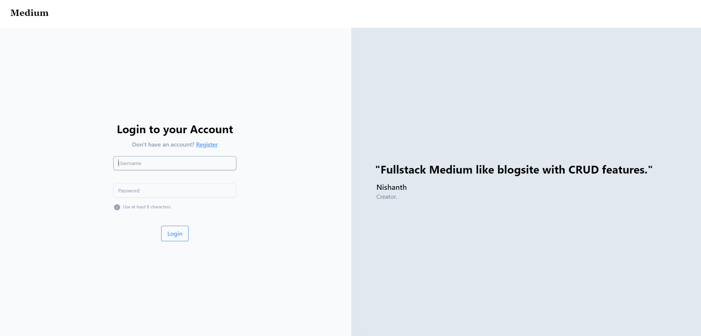
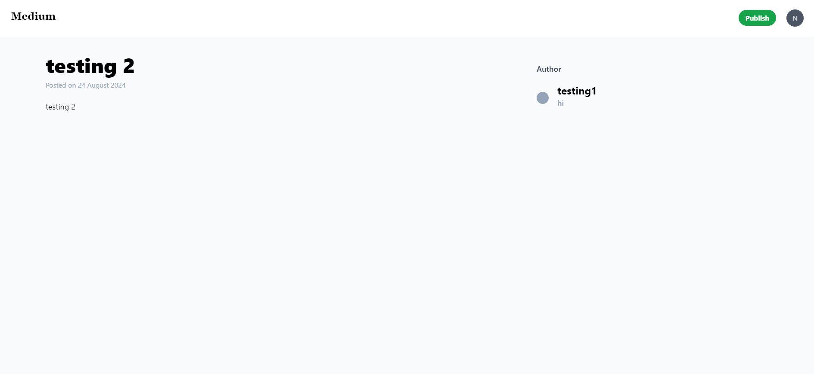

# Medium
Medium like full stack application with authenticated surfing, built using ReactJS, HonoJS, Prisma, NodeJS. Frontend is deployed on Vercel.

<p align="center">
    
    
</p>

## Pre-requisites
* ```node```
* ```tsc```

## Build
```bash
git clone https://github.com/Nishaaaanth/medium
cd medium
npm i
```

## Run Backend
Update ```DATABASE_URL``` & ```JWT_SECRET``` variables on ```.env``` and ```wrangler.toml``` file with your unique databse url and secret key for JWT.
```bash
cd backend/
npm run dev
```

## Run Frontend
Update ```BACKEND_URL``` on ```config.ts``` file with ```http://localhost:3000```
```bash
cd frontend/
npm run dev
```

<b align="center">Preview : [Medium](https://medium-eight-drab.vercel.app/)</b>

